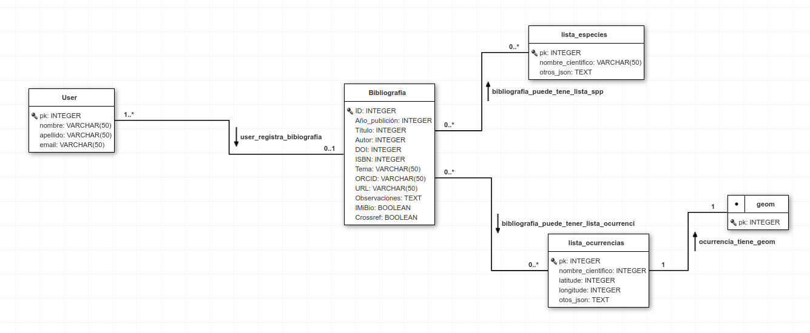

# Bibliography app
##Publicaciones
La app `bibliography` hace parte del sistema de gestión de conocimiento del IMIBIO. Está creada para registrar infomraciones a respecto de libros, artículos y otros tipos de publicaciones. Posee la capacidad de resgatar información oficial de las publicaciones que tienen [DOI (Digital Object Identification)](https://www.doi.org/) o [ISBN (International Standard Book)](https://www.isbn.org.ar/). Aquellas publicaciones que no poseen DOI ni ISBN, podrán ser cargadas siendo necesário que el usuário registro todas las informaciones conocidas de manera manual. En dichos casos, **el sistema no aceptará registro de publicaciones sin `título`, `autor` y `año de publicación`.** 

El campo booleano `crossref`, que posee valor por defecto `True` sive para indicar cuando la publicación posee `DOI` o `ISBN`, sendo usada como um indicador del sistema cuando se debe usar las APIs de rescate de metadatos.

Trás el registro de la publicación el usuário podrá editar los campos, y tambien añadir una lista de especies y una lista de ocurrencias relacionada a la publicacion.
##Lista de especies y  Lista de ocurrencias
Las publicaciones cargadas podrán tener una lista de especies y una lista de ocurrencias, la cual serán cargada en formato .Csv (comma separated values)
###Lista de especies
Lista de especie podrá tener todo tipo de información relacionada a la especie solo debera tener como primera columna obligatoria scientific_name (nombre científico). 
###Lista de ocurrencias
Lista de ocurrencias podrá tener todo tipo de información relacionada a la especie pero con los campos de latitud y longitud, esta se diferencia porque las tres columnas obligatorias son scientific_name (nombre científico), latitude(latitud) y longitud(longitude).
## APIs
La app usa API´S de [Crossrefapi](https://www.crossref.org/blog/python-and-ruby-libraries-for-accessing-the-crossref-api/) y [isbnlib](https://pypi.org/project/isbnlib/), para rescatar los metadatos de `DOI` y `ISBN`, respectivamente.
 
### Validadores y limpieza  
* [`validate_isbn`](sysimibio/bibliography/validators.py): Es usado para validar el campo `ISBN`, confirmando que el valor ingresado tenga 10 o 13 dígitos. Caso contrário retorna un `ValidationError`  
* En el método [`clean()`](sysimibio/bibliography/forms.py) de `PublicationForm`:  
    *  se hace la confirmación de la existencia de un valor de `DOI`, `ISBN` y `crossref` habilitado (`True`). Caso contrário, retorna `ValidationError`.  
    * se hace la confirmar ción de la existéncia de valores para `título`, `autor` y `año de publicación` para cuando el `crossref` estes deshabilitado (`False`). Caso contrário, retorna `ValidationError`.  
* En el método [`clean_ISBN`](sysimibio/bibliography/forms.py) de `PublicationForm`:  
    * Se hace un proceso de limpieza de los valores ingresados de `ISBN`:  
        * se excluyen los guiones y puntos;  
        * se convirte `ISBN` de 10 caracteres para 13, usando `isblib`    
* En el metodo `UploadSpeciesListForm` y `UploadOccurrencesListForm`
    * Se excluyen los archivos que no sean formato .CSV mediante la extensión `FileExtensionValidator`
    * En la view se excluirán los archivos que no posean las columnas obligatorias.
## Base de datos  
  
