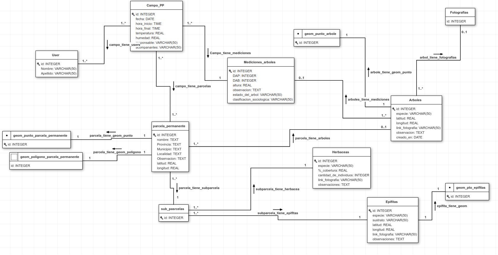

# IMiBio's Tree Ecological Data (Permanent Plot invetigation - PPI)
La app `PPI` hace parte del sistema de gestión de datos de biodiversidad del IMIBIO. Está creada para almacenar y gestionar los datos relacionados a las percelas permanentes de investigación.

### Validadores y limpieza 
* En el método [`clean()`](sysimibio/imibio_ecological_data/forms.py) de `XPTOForm`:
    *  se hace la confirmación de... Caso contrário, retorna `ValidationError`.

## Base de datos  
  
